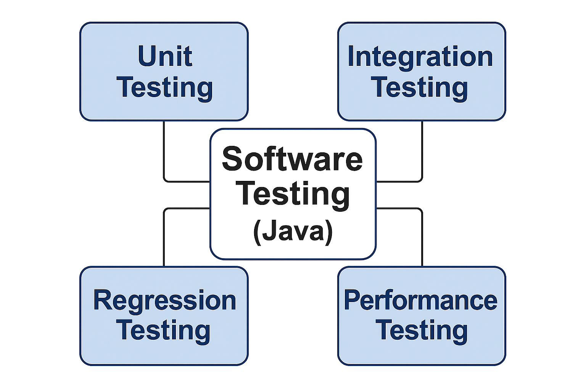
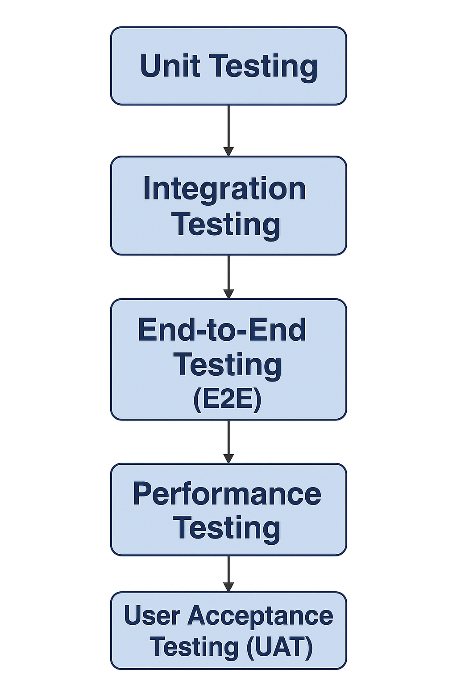
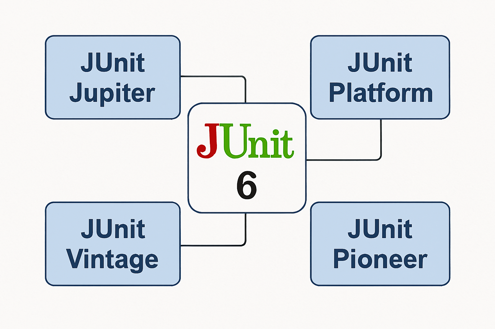

# Day 1: JUnit Fundamentals

## Unit Testing Principles
- **Definition**: Unit testing is the practice of testing individual units (methods/classes) of code in isolation.
- **Goals**:
    - Ensure correctness of logic.
    - Catch bugs early in the development cycle.
    - Improve maintainability and confidence in refactoring.
- **Principles**:
    - Tests should be **independent**.
    - Tests should be **repeatable**.
    - Tests should be **fast**.
    - Tests should be **self-validating** (pass/fail without manual inspection).

---

## Java Software Testing



### Testing Progress

Flow of different test phases...



Typical software or frameworks used 
- Unit Testing - JUnit/Mockito, etc
- Integration Testing - Spring Test, etc
- End-to-End Testing - Selenium(UI), Cypress(JS Based), TestNG, Cucumber, etc
- Performance Testing - JMeter, K6, Gatling, etc
- User Acceptance Testing(UAT) - Cumcumber, etc

Note: 
- Above reference to testing tools & framework is just an indicative one, choice of framework is project/ecosystem dependent.
- Sometimes UAT & Performance test happen in parallel as well depending on the individual projects specific delivery needs i.e. there is no strong compliance needs in the testing flow between the two
- Projects also include Security/Penetration Testing, Accessibility testing, etc depending on the nature of the application. 


### Whit Box vs Black Box Testing

White box testing examines code structure and internal logic (requires programming knowledge), while black box testing focuses on external functionality (user perspective, no code knowledge needed), with black box verifying what the system does (inputs/outputs) and white box verifying how it does it (internal paths/conditions)


## JUnit Architecture 



**JUnit = JUnit Platform + JUnit Jupiter + JUnit Vintage**

- JUnit Platform: This serves as the foundation for launching testing frameworks on the Java Virtual Machine (JVM). It provides the TestEngine API for other testing frameworks to plug into, a console launcher, and integrates with IDEs and build tools like Maven and Gradle.
- JUnit Jupiter: This is the combination of the programming model and the extension model for writing modern JUnit tests and extensions. It provides a TestEngine implementation for running tests written with Jupiter APIs on the platform.
- JUnit Vintage: This component provides a TestEngine for running tests written in older JUnit 3 and JUnit 4 styles on the JUnit Platform. It requires JUnit 4.12 or later on the classpath and is intended for backward compatibility during migration.
- JUnit Pioneer: This is a separate, independent library that provides extensions for the core JUnit framework; it is not included as an official part of the main JUnit 6 release.

- **JUnit in SDLC**: Fits into the *test phase* of CI/CD pipelines, enabling automated regression checks.

## Maven Setup
  ```xml
    <dependency>
      <groupId>org.junit.jupiter</groupId>
      <artifactId>junit-jupiter</artifactId>
      <version>6.0.1</version>
      <scope>compile</scope>
    </dependency>
  ```

---

## Basic `@Test` and Assertions
- **`@Test` Annotation**: Marks a method as a test case.
- **Assertions**:
  ```java
  @Test
  void testAddition() {
      int result = 2 + 3;
      assertEquals(5, result);
      assertTrue(result > 0);
  }

  @Test
  void testException() {
      assertThrows(ArithmeticException.class, () -> {
          int result = 10 / 0;
      });
  }
  ```

---

## Hands-on: First Test Class
```java
class MathUtils {
    
    int add(int a, int b) { 
        return a + b; 
    }
    
    int divide(int a, int b) { 
        return a / b; 
    }
}

class MathUtilsTest {
    @Test
    void testAdd() {
        MathUtils mu = new MathUtils();
        assertEquals(7, mu.add(3,4));
    }
}
```

---

## Lifecycle Annotations
- **`@BeforeEach`**: Runs before each test.
- **`@AfterEach`**: Runs after each test.
- **`@BeforeAll`**: Runs once before all tests (must be static).
- **`@AfterAll`**: Runs once after all tests.

```java
@BeforeEach
void init() { System.out.println("Starting test..."); }

@AfterEach
void cleanup() { System.out.println("Cleaning up..."); }
```

---

## `@DisplayName`, `@Disabled`, Exception Testing
- **`@DisplayName`**: Customizes test names.
- **`@Disabled`**: Skips a test.
- **Exception Testing**: Use `assertThrows`.

```java
@DisplayName("Addition Test")
@Test
void testAddNumbers() { 
    assertEquals(10, 5+5); 
}

@Disabled("Feature not ready")
@Test
void testFutureFeature() { /* skipped */ }
```

---

## Exercises: Calculator Class
**Task**: Write tests for a `Calculator` class.
```java
class Calculator {
    
    int add(int a, int b) { 
        return a + b; 
    }
    
    int subtract(int a, int b) {
        return a - b; 
    }
    
    int multiply(int a, int b) {
        return a * b; 
    }
    
    int divide(int a, int b) {
        return a / b; 
    }
}
```

**Tests**:
- Verify addition, subtraction, multiplication, division.
- Edge cases: division by zero, large numbers, negative inputs.

---

## Discussion: Test Naming Conventions
- Use **descriptive names**: `shouldThrowExceptionWhenDividingByZero`.
- Prefer **camelCase** or **snake_case** consistently.
- Include **expected behavior** in the name.

---